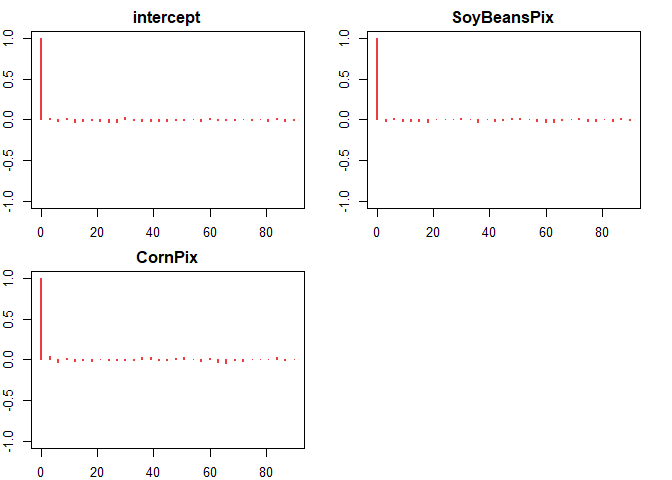
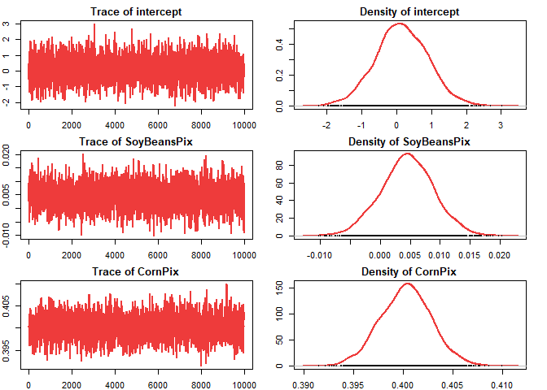

# saeHB.unit

<!-- badges: start -->

[](https://CRAN.R-project.org/package=saeHB.unit) [](https://github.com/Alfrzlp/saeHB.unit/actions/workflows/check-standard.yaml)

<!-- badges: end -->

We designed this package to provide several functions for unit level of small area estimation (Battese, Harter and Fuller model) using hierarchical Bayesian (HB) method. This package also provides a dataset produced by a data generation. The `rjags` package is employed to obtain parameter estimates

## Installation

You can install the development version of saeHB.unit from [GitHub](https://github.com/) with:


```r
# install.packages("devtools")
devtools::install_github("Alfrzlp/saeHB.unit")
#> Skipping install of 'saeHB.unit' from a github remote, the SHA1 (98e8bda4) has not changed since last install.
#>   Use `force = TRUE` to force installation
```

Or you can install cran version with


```r
# install.packages(saeHB.unit)
```

## Example

This is a basic example which shows you how to solve a common problem:


```r
library(dplyr)
library(saeHB.unit)

glimpse(cornsoybean)
#> Rows: 37
#> Columns: 5
#> $ County      <int> 1, 2, 3, 4, 4, 5, 5, 5, 6, 6, 6, 7, 7, 7, 8, 8, 8, 9, 9, 9…
#> $ CornHec     <dbl> 165.76, 96.32, 76.08, 185.35, 116.43, 162.08, 152.04, 161.…
#> $ SoyBeansHec <dbl> 8.09, 106.03, 103.60, 6.47, 63.82, 43.50, 71.43, 42.49, 10…
#> $ CornPix     <int> 374, 209, 253, 432, 367, 361, 288, 369, 206, 316, 145, 355…
#> $ SoyBeansPix <int> 55, 218, 250, 96, 178, 137, 206, 165, 218, 221, 338, 128, …
glimpse(cornsoybeanmeans)
#> Rows: 12
#> Columns: 6
#> $ CountyIndex           <int> 1, 2, 3, 4, 5, 6, 7, 8, 9, 10, 11, 12
#> $ CountyName            <fct> CerroGordo, Hamilton, Worth, Humboldt, Franklin,…
#> $ SampSegments          <int> 1, 1, 1, 2, 3, 3, 3, 3, 4, 5, 5, 6
#> $ PopnSegments          <dbl> 545, 566, 394, 424, 564, 570, 402, 567, 687, 569…
#> $ MeanCornPixPerSeg     <dbl> 295.29, 300.40, 289.60, 290.74, 318.21, 257.17, …
#> $ MeanSoyBeansPixPerSeg <dbl> 189.70, 196.65, 205.28, 220.22, 188.06, 247.13, …
```


```r
Xarea <- cornsoybeanmeans %>%
   dplyr::select(
      County = CountyIndex,
      CornPix = MeanCornPixPerSeg,
      SoyBeansPix = MeanSoyBeansPixPerSeg
   )
head(Xarea)
#>   County CornPix SoyBeansPix
#> 1      1  295.29      189.70
#> 2      2  300.40      196.65
#> 3      3  289.60      205.28
#> 4      4  290.74      220.22
#> 5      5  318.21      188.06
#> 6      6  257.17      247.13
```


```r
corn_model <- hb_BHF(
   CornHec ~ SoyBeansPix + CornPix,
   data_unit = cornsoybean,
   data_area = Xarea,
   domain = "County",
   iter.update = 20
)
```



```
#>                   Mean         SD       2.5%        25%        50%        75%
#> intercept    0.1552265  0.7415844 -1.3078113 -0.3262636  0.1458748  0.6601395
#> SoyBeansPix  0.0045318  0.0044236 -0.0041645  0.0016640  0.0045969  0.0074832
#> CornPix      0.4002724  0.0025485  0.3951512  0.3985503  0.4002998  0.4019972
#>              97.5%
#> intercept   1.6317
#> SoyBeansPix 0.0132
#> CornPix     0.4053
```

# References

-   Battese, G. E., Harter, R. M., & Fuller, W. A. (1988). An error-components model for prediction of county crop areas using survey and satellite data. Journal of the American Statistical Association, 83(401), 28-36.

-   Rao, J. N., & Molina, I. (2015). Small area estimation. John Wiley & Sons.
