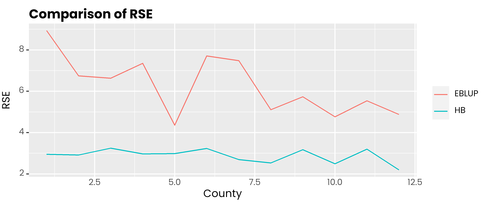
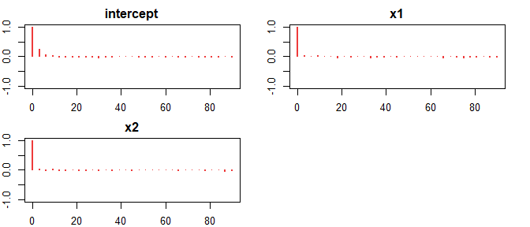
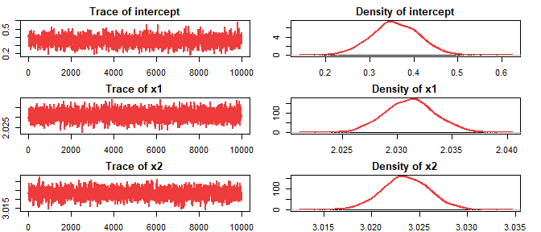

# saeHB.unit

<!-- badges: start -->

[](https://CRAN.R-project.org/package=saeHB.unit)
[](https://github.com/Alfrzlp/saeHB.unit/actions/workflows/check-standard.yaml)

<!-- badges: end -->

# Author

Azka Ubaidillah, Ridson Al Farizal P

# Maintainer

Ridson Al Farizal P \<alfrzlp@gmail.com\>

# Description

We designed this package to provide function for unit level of small
area estimation (Battese, Harter and Fuller model) using hierarchical
Bayesian (HB) method. It also provides datasets generated by data
generation (`dummy_unit` and `dummy_area`) and real dataset
(`cornsoybean` and `cornsoybeanmean`). The `rjags` package is employed
to obtain parameter estimates

# Installation

You can install the development version of saeHB.unit from
[GitHub](https://github.com/) with:

``` r
install.packages("devtools")
devtools::install_github("Alfrzlp/saeHB.unit")
```

Or you can install cran version with

``` r
install.packages(saeHB.unit)
```

## Example 1

This is a basic example which shows you how to solve a common problem:

``` r
library(saeHB.unit)
library(ggplot2)
library(dplyr)
library(tidyr)
library(sae)

windowsFonts(
  poppins = windowsFont('poppins')
)
```

### Data

``` r
glimpse(cornsoybean)
#> Rows: 37
#> Columns: 5
#> $ County      <int> 1, 2, 3, 4, 4, 5, 5, 5, 6, 6, 6, 7, 7, 7, 8, 8, 8, 9, 9, 9…
#> $ CornHec     <dbl> 165.76, 96.32, 76.08, 185.35, 116.43, 162.08, 152.04, 161.…
#> $ SoyBeansHec <dbl> 8.09, 106.03, 103.60, 6.47, 63.82, 43.50, 71.43, 42.49, 10…
#> $ CornPix     <int> 374, 209, 253, 432, 367, 361, 288, 369, 206, 316, 145, 355…
#> $ SoyBeansPix <int> 55, 218, 250, 96, 178, 137, 206, 165, 218, 221, 338, 128, …
glimpse(cornsoybeanmeans)
#> Rows: 12
#> Columns: 6
#> $ CountyIndex           <int> 1, 2, 3, 4, 5, 6, 7, 8, 9, 10, 11, 12
#> $ CountyName            <fct> CerroGordo, Hamilton, Worth, Humboldt, Franklin,…
#> $ SampSegments          <int> 1, 1, 1, 2, 3, 3, 3, 3, 4, 5, 5, 6
#> $ PopnSegments          <dbl> 545, 566, 394, 424, 564, 570, 402, 567, 687, 569…
#> $ MeanCornPixPerSeg     <dbl> 295.29, 300.40, 289.60, 290.74, 318.21, 257.17, …
#> $ MeanSoyBeansPixPerSeg <dbl> 189.70, 196.65, 205.28, 220.22, 188.06, 247.13, …
```

``` r
Xarea <- cornsoybeanmeans %>%
   dplyr::select(
      County = CountyIndex,
      CornPix = MeanCornPixPerSeg,
      SoyBeansPix = MeanSoyBeansPixPerSeg
   )
head(Xarea)
#>   County CornPix SoyBeansPix
#> 1      1  295.29      189.70
#> 2      2  300.40      196.65
#> 3      3  289.60      205.28
#> 4      4  290.74      220.22
#> 5      5  318.21      188.06
#> 6      6  257.17      247.13
```

### EBLUP model

``` r
Popn <- cornsoybeanmeans %>% 
  dplyr::select(CountyIndex, PopnSegments)

corn_eblup <- pbmseBHF(
  CornHec ~ CornPix + SoyBeansPix,
  dom = County,
  meanxpop = Xarea, popnsize = Popn, data = cornsoybean, B = 50
)
#> 
#> Bootstrap procedure with B = 50 iterations starts.
#> b = 1 
#> b = 2 
#> b = 3 
#> b = 4
#> boundary (singular) fit: see help('isSingular')
#> b = 5 
#> b = 6 
#> b = 7 
#> b = 8 
#> b = 9 
#> b = 10
#> boundary (singular) fit: see help('isSingular')
#> b = 11 
#> b = 12 
#> b = 13 
#> b = 14
#> boundary (singular) fit: see help('isSingular')
#> b = 15 
#> b = 16 
#> b = 17 
#> b = 18 
#> b = 19 
#> b = 20
#> boundary (singular) fit: see help('isSingular')
#> b = 21 
#> b = 22
#> boundary (singular) fit: see help('isSingular')
#> b = 23 
#> b = 24 
#> b = 25 
#> b = 26 
#> b = 27 
#> b = 28 
#> b = 29 
#> b = 30 
#> b = 31 
#> b = 32 
#> b = 33 
#> b = 34 
#> b = 35 
#> b = 36 
#> b = 37 
#> b = 38 
#> b = 39 
#> b = 40 
#> b = 41 
#> b = 42
#> boundary (singular) fit: see help('isSingular')
#> b = 43 
#> b = 44 
#> b = 45 
#> b = 46 
#> b = 47 
#> b = 48
#> boundary (singular) fit: see help('isSingular')
#> b = 49 
#> b = 50

rse_eblup <- sqrt(corn_eblup$mse$mse) * 100 / corn_eblup$est$eblup$eblup
```

### HB model

``` r
corn_hb <- hb_unit(
   CornHec ~ SoyBeansPix + CornPix,
   data_unit = cornsoybean,
   data_area = Xarea,
   domain = "County",
   iter.update = 20
)
```

<!-- --><!-- -->

    #>                   Mean         SD       2.5%        25%        50%        75%
    #> intercept    0.1552265  0.7415844 -1.3078113 -0.3262636  0.1458748  0.6601395
    #> SoyBeansPix  0.0045318  0.0044236 -0.0041645  0.0016640  0.0045969  0.0074832
    #> CornPix      0.4002724  0.0025485  0.3951512  0.3985503  0.4002998  0.4019972
    #>              97.5%
    #> intercept   1.6317
    #> SoyBeansPix 0.0132
    #> CornPix     0.4053

### Comparison

``` r
data.frame(
  id = 1:12,
  hb = corn_hb$Est$MEAN,
  eblup = corn_eblup$est$eblup$eblup
) %>%
  pivot_longer(-1, names_to = "metode", values_to = "rse") %>%
  ggplot(aes(x = id, y = rse, col = metode)) +
  geom_line() +
  scale_color_discrete(
    labels = c('EBLUP', 'HB')
  ) +
  labs(col = NULL, y = 'Estimate', x = 'County', title = 'Comparison of estimates') +
  theme(
    text = element_text(family = 'poppins'),
    axis.ticks.x = element_blank(),
    plot.title = element_text(face = 2, vjust = 0),
    plot.subtitle = element_text(colour = 'gray30', vjust = 0)
  )
```

<!-- -->

``` r
data.frame(
  id = 1:12,
  hb = corn_hb$Est$SD * 100 / corn_hb$Est$MEAN,
  eblup = rse_eblup
) %>%
  pivot_longer(-1, names_to = "metode", values_to = "rse") %>%
  ggplot(aes(x = id, y = rse, col = metode)) +
  geom_line() +
  scale_color_discrete(
    labels = c('EBLUP', 'HB')
  ) +
  labs(col = NULL, y = 'RSE', x = 'County', title = 'Comparison of RSE') +
  theme(
    text = element_text(family = 'poppins'),
    axis.ticks.x = element_blank(),
    plot.title = element_text(face = 2, vjust = 0),
    plot.subtitle = element_text(colour = 'gray30', vjust = 0)
  )
```

<!-- -->

## Example 2

### Data

``` r
head(dummy_unit)
#>      domain     y_di       x1       x2
#> 181      d1 72.67585 13.88978 14.35716
#> 279      d1 63.10395 10.38460 13.58800
#> 343      d1 80.10076 16.36110 14.59864
#> 539      d1 68.83004 13.33046 14.17516
#> 670      d1 77.48515 18.62796 12.55454
#> 1424     d1 78.00826 13.44454 16.34891
```

``` r
head(dummy_area)
#>   domain       x1       x2 parameter
#> 1     d1 15.05076 14.96766  77.03467
#> 2     d2 15.07153 14.98934  74.67858
#> 3     d3 14.96426 14.94145  73.35885
#> 4     d4 15.03803 15.02529  77.99655
#> 5     d5 14.98165 14.99815  76.76959
#> 6     d6 15.04244 15.00129  77.30116
```

### Model

``` r
hb_model <- hb_unit(
  formula = y_di ~ x1 + x2,
  data_unit = dummy_unit,
  data_area = dummy_area,
  domain = "domain",
  iter.update = 30,
  plot = FALSE
)
#> Update 2/30 | ■■■                                7% | ETA:  1m Update 3/30 | ■■■■                              10% | ETA:  1m Update 4/30 | ■■■■■                             13% | ETA:  2m Update 5/30 | ■■■■■■                            17% | ETA:  2m Update 6/30 | ■■■■■■■                           20% | ETA:  2m Update 7/30 | ■■■■■■■■                          23% | ETA:  2m Update 8/30 | ■■■■■■■■■                         27% | ETA:  1m Update 9/30 | ■■■■■■■■■■                        30% | ETA:  1m Update 10/30 | ■■■■■■■■■■■                       33% | ETA:  1m Update 11/30 | ■■■■■■■■■■■■                      37% | ETA:  1m Update 12/30 | ■■■■■■■■■■■■■                     40% | ETA:  1m Update 13/30 | ■■■■■■■■■■■■■■                    43% | ETA:  1m Update 14/30 | ■■■■■■■■■■■■■■■                   47% | ETA:  1m Update 15/30 | ■■■■■■■■■■■■■■■■                  50% | ETA:  1m Update 16/30 | ■■■■■■■■■■■■■■■■■                 53% | ETA:  1m Update 17/30 | ■■■■■■■■■■■■■■■■■■                57% | ETA:  1m Update 18/30 | ■■■■■■■■■■■■■■■■■■■               60% | ETA:  1m Update 19/30 | ■■■■■■■■■■■■■■■■■■■■              63% | ETA: 48s Update 20/30 | ■■■■■■■■■■■■■■■■■■■■■             67% | ETA: 43s Update 21/30 | ■■■■■■■■■■■■■■■■■■■■■■            70% | ETA: 39s Update 22/30 | ■■■■■■■■■■■■■■■■■■■■■■■           73% | ETA: 35s Update 23/30 | ■■■■■■■■■■■■■■■■■■■■■■■■          77% | ETA: 31s Update 24/30 | ■■■■■■■■■■■■■■■■■■■■■■■■■         80% | ETA: 26s Update 25/30 | ■■■■■■■■■■■■■■■■■■■■■■■■■■        83% | ETA: 22s Update 26/30 | ■■■■■■■■■■■■■■■■■■■■■■■■■■■       87% | ETA: 18s Update 27/30 | ■■■■■■■■■■■■■■■■■■■■■■■■■■■■      90% | ETA: 13s Update 28/30 | ■■■■■■■■■■■■■■■■■■■■■■■■■■■■■     93% | ETA:  9s Update 29/30 | ■■■■■■■■■■■■■■■■■■■■■■■■■■■■■■    97% | ETA:  4s                                                                  
#> ── Coefficient ─────────────────────────────────────────────────────────────────
#>                Mean        SD      2.5%       25%       50%       75%  97.5%
#> intercept 0.3727118 0.0618364 0.2510833 0.3317597 0.3735558 0.4132707 0.4953
#> x1        2.0305772 0.0023850 2.0259770 2.0289838 2.0304987 2.0321898 2.0352
#> x2        3.0235272 0.0024196 3.0187927 3.0219169 3.0235365 3.0251780 3.0282
```

This dataset contains NA in 5 domains out of 30 domains.

``` r
dummy_unit %>% 
  dplyr::filter(is.na(y_di))
#>     domain y_di       x1       x2
#> 1      d14   NA 14.56105 15.73387
#> 2      d14   NA 13.28399 10.49971
#> 3      d14   NA 13.95985 17.36882
#> 4      d14   NA 14.86162 19.58186
#> 5      d14   NA 19.86265 13.27159
#> 6      d14   NA 14.68221 16.34512
#> 7      d14   NA 12.64410 15.39172
#> 8      d14   NA 10.56408 19.60424
#> 9      d14   NA 14.91899 18.66672
#> 10     d14   NA 11.57345 14.49548
#> 11     d14   NA 14.98158 18.32154
#> 12     d14   NA 11.17345 16.46726
#> 13     d14   NA 12.72136 17.69672
#> 14     d14   NA 18.25970 15.03484
#> 15     d14   NA 13.35309 10.24535
#> 16     d14   NA 18.02001 17.15815
#> 17     d14   NA 11.17606 13.50988
#> 18     d14   NA 16.65338 17.98861
#> 19     d14   NA 12.58023 11.79145
#> 20     d14   NA 16.15348 12.09379
#> 21     d14   NA 14.91293 14.10810
#> 22     d14   NA 19.96504 13.36750
#> 23     d14   NA 16.56609 16.05886
#> 24     d14   NA 19.29957 12.19052
#> 25     d14   NA 13.54171 12.75343
#> 26     d14   NA 10.21236 12.23435
#> 27     d14   NA 17.99604 15.36424
#> 28     d14   NA 12.11656 17.99746
#> 29     d14   NA 14.60019 14.33316
#> 30     d16   NA 17.91784 16.23897
#> 31     d16   NA 15.43839 17.56159
#> 32     d16   NA 13.17545 12.31333
#> 33     d16   NA 15.61394 19.16791
#> 34     d16   NA 18.84890 18.61925
#> 35     d16   NA 13.47897 19.92013
#> 36     d16   NA 16.59974 10.99873
#> 37     d16   NA 15.51909 16.38987
#> 38     d16   NA 12.30574 18.12209
#> 39     d16   NA 14.81772 17.29948
#> 40     d16   NA 16.36439 19.93191
#> 41     d16   NA 14.20898 13.06848
#> 42     d16   NA 13.07458 14.41681
#> 43     d16   NA 10.34657 15.03511
#> 44     d16   NA 11.00211 17.04295
#> 45     d16   NA 11.59521 17.70048
#> 46     d16   NA 10.87042 14.48175
#> 47     d16   NA 13.95993 12.40845
#> 48     d16   NA 18.71288 11.18132
#> 49     d16   NA 16.39070 17.63769
#> 50     d16   NA 18.33160 11.46246
#> 51     d16   NA 14.43888 14.98010
#> 52     d16   NA 10.12364 10.06999
#> 53     d16   NA 10.82664 19.33111
#> 54     d16   NA 10.50678 13.72983
#> 55     d16   NA 15.62215 17.08902
#> 56     d16   NA 19.03012 19.55314
#> 57     d16   NA 13.88522 18.17395
#> 58     d16   NA 15.92359 13.09609
#> 59     d16   NA 13.06243 17.58942
#> 60     d16   NA 11.92322 13.35713
#> 61     d22   NA 14.79173 13.13999
#> 62     d22   NA 19.48796 11.25034
#> 63     d22   NA 19.00794 11.30174
#> 64     d22   NA 17.26503 14.28242
#> 65     d22   NA 11.68311 17.58314
#> 66     d22   NA 13.29425 18.57874
#> 67     d22   NA 12.78671 12.81297
#> 68     d22   NA 12.26944 10.24241
#> 69     d22   NA 15.74607 11.27710
#> 70     d22   NA 19.49097 12.37938
#> 71     d22   NA 10.30735 10.48193
#> 72     d22   NA 17.71938 19.73098
#> 73     d22   NA 17.87899 12.56956
#> 74     d22   NA 13.19473 17.21670
#> 75     d22   NA 12.03641 19.75145
#> 76     d22   NA 10.37611 11.63313
#> 77     d22   NA 10.21821 12.20776
#> 78     d22   NA 15.88424 16.33162
#> 79     d22   NA 14.26671 12.11250
#> 80     d22   NA 19.04981 10.91262
#> 81     d22   NA 16.09385 13.58752
#> 82     d22   NA 13.11331 12.55060
#> 83     d22   NA 10.25786 15.74032
#> 84     d22   NA 18.83828 13.43328
#> 85     d22   NA 16.83220 13.32062
#> 86     d22   NA 18.24051 18.35369
#> 87     d22   NA 15.51315 19.08010
#> 88     d22   NA 18.23732 13.96543
#> 89     d22   NA 10.47234 14.21405
#> 90     d22   NA 19.92523 16.91586
#> 91     d22   NA 19.86533 14.53576
#> 92     d22   NA 15.15362 18.39457
#> 93     d22   NA 10.85330 18.05353
#> 94     d22   NA 12.85312 14.11773
#> 95     d22   NA 14.08253 18.23391
#> 96     d22   NA 15.86580 14.00120
#> 97     d27   NA 19.58241 13.91881
#> 98     d27   NA 11.60662 12.87651
#> 99     d27   NA 11.40271 15.68786
#> 100    d27   NA 17.55850 16.63147
#> 101    d27   NA 13.87925 16.29812
#> 102    d27   NA 17.60698 15.91963
#> 103    d27   NA 11.87967 18.65209
#> 104    d27   NA 17.67948 15.25664
#> 105    d27   NA 13.49637 11.45061
#> 106    d27   NA 16.74381 17.27901
#> 107    d27   NA 10.24939 19.90985
#> 108    d27   NA 10.82980 14.37207
#> 109    d27   NA 14.48265 18.93624
#> 110    d27   NA 12.17589 19.38341
#> 111    d27   NA 14.21628 14.84862
#> 112    d27   NA 17.78283 17.57790
#> 113    d27   NA 18.77808 15.88993
#> 114    d27   NA 16.45288 10.85990
#> 115    d27   NA 16.27012 11.93000
#> 116    d27   NA 16.53258 12.64990
#> 117    d27   NA 14.00442 15.92979
#> 118    d27   NA 16.12038 17.98986
#> 119    d27   NA 13.87459 13.50042
#> 120    d27   NA 12.65145 11.72645
#> 121    d27   NA 19.09201 12.22442
#> 122    d27   NA 14.84473 18.45394
#> 123    d27   NA 10.36423 14.86852
#> 124    d27   NA 12.85919 14.17478
#> 125    d27   NA 15.41675 10.62751
#> 126    d27   NA 15.44831 17.61744
#> 127    d27   NA 14.20820 10.12895
#> 128    d29   NA 17.66976 12.31572
#> 129    d29   NA 10.80247 19.75126
#> 130    d29   NA 16.59205 13.65168
#> 131    d29   NA 12.82421 18.62455
#> 132    d29   NA 15.17012 14.59060
#> 133    d29   NA 19.26962 14.07037
#> 134    d29   NA 16.36532 18.45217
#> 135    d29   NA 17.02257 14.90186
#> 136    d29   NA 11.36371 13.93829
#> 137    d29   NA 19.07447 17.52829
#> 138    d29   NA 17.36496 18.53182
#> 139    d29   NA 12.48905 14.98254
#> 140    d29   NA 10.66030 15.72723
#> 141    d29   NA 19.19565 17.69969
#> 142    d29   NA 16.31114 10.05808
#> 143    d29   NA 10.01688 14.78977
#> 144    d29   NA 17.68887 14.12503
#> 145    d29   NA 10.89248 16.39320
#> 146    d29   NA 10.75287 12.59908
#> 147    d29   NA 11.21572 16.48889
#> 148    d29   NA 10.48021 18.48691
#> 149    d29   NA 11.58925 13.12789
#> 150    d29   NA 12.49612 17.66456
#> 151    d29   NA 18.17724 17.54607
#> 152    d29   NA 19.11363 15.73160
#> 153    d29   NA 15.13372 17.11448
```

``` r
dummy_unit %>% 
  dplyr::filter(is.na(y_di)) %>% 
  distinct(domain)
#>   domain
#> 1    d14
#> 2    d16
#> 3    d22
#> 4    d27
#> 5    d29
```

## Autocorelation, Trace and Density plot

``` r
saeHB.unit::autoplot(hb_model)
```

<!-- --><!-- -->

## Coefficients

``` r
summary(hb_model)
#>                Mean        SD      2.5%       25%       50%       75%  97.5%
#> intercept 0.3727118 0.0618364 0.2510833 0.3317597 0.3735558 0.4132707 0.4953
#> x1        2.0305772 0.0023850 2.0259770 2.0289838 2.0304987 2.0321898 2.0352
#> x2        3.0235272 0.0024196 3.0187927 3.0219169 3.0235365 3.0251780 3.0282
```

``` r
data.frame(
  id = 1:30,
  hb = hb_model$Est$MEAN,
  parameter = dummy_area$parameter
) %>%
  pivot_longer(-1, names_to = "metode", values_to = "rse") %>%
  ggplot(aes(x = id, y = rse, col = metode)) +
  geom_line() +
  scale_color_discrete(
    labels = c('HB with NA', 'Parameter')
  ) +
  labs(col = NULL, y = 'Estimate', x = 'County', title = 'Comparison of estimates') +
  theme(
    text = element_text(family = 'poppins'),
    axis.ticks.x = element_blank(),
    plot.title = element_text(face = 2, vjust = 0),
    plot.subtitle = element_text(colour = 'gray30', vjust = 0)
  )
```

<!-- -->

# References

- Battese, G. E., Harter, R. M., & Fuller, W. A. (1988). An
  error-components model for prediction of county crop areas using
  survey and satellite data. Journal of the American Statistical
  Association, 83(401), 28-36.

- Rao, J. N., & Molina, I. (2015). Small area estimation. John Wiley &
  Sons.
