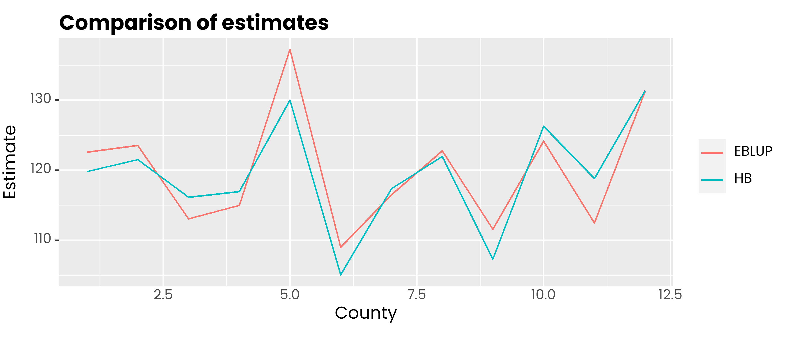

# saeHB.unit

<!-- badges: start -->

[](https://github.com/Alfrzlp/saeHB.unit/actions/workflows/check-standard.yaml)
[](https://CRAN.R-project.org/package=saeHB.unit)


<!-- badges: end -->

# Author

Azka Ubaidillah, Ridson Al Farizal P

# Maintainer

Ridson Al Farizal P \<alfrzlp@gmail.com\>

# Description

We designed this package to provide a function for small area estimation
unit-level model (Battese, Harter, and Fuller model) using the
hierarchical bayesian (HB) method. It also provides datasets generated
by data generation (`dummy_unit` and `dummy_area`) and real datasets
(`cornsoybean` and `cornsoybeanmean`). The `rjags` package is employed
to obtain parameter estimates.

# Installation

You can install the development version of saeHB.unit from
[GitHub](https://github.com/) with:

``` r
install.packages("devtools")
devtools::install_github("Alfrzlp/saeHB.unit")
```

Or you can install cran version with

``` r
install.packages(saeHB.unit)
```

## Example 1

This is a basic example which shows you how to solve a common problem:

``` r
library(saeHB.unit)
library(ggplot2)
library(dplyr)
library(tidyr)
library(sae)

windowsFonts(
  poppins = windowsFont('poppins')
)
```

### Data

``` r
glimpse(cornsoybean)
#> Rows: 37
#> Columns: 5
#> $ County      <int> 1, 2, 3, 4, 4, 5, 5, 5, 6, 6, 6, 7, 7, 7, 8, 8, 8, 9, 9, 9…
#> $ CornHec     <dbl> 165.76, 96.32, 76.08, 185.35, 116.43, 162.08, 152.04, 161.…
#> $ SoyBeansHec <dbl> 8.09, 106.03, 103.60, 6.47, 63.82, 43.50, 71.43, 42.49, 10…
#> $ CornPix     <int> 374, 209, 253, 432, 367, 361, 288, 369, 206, 316, 145, 355…
#> $ SoyBeansPix <int> 55, 218, 250, 96, 178, 137, 206, 165, 218, 221, 338, 128, …
glimpse(cornsoybeanmeans)
#> Rows: 12
#> Columns: 6
#> $ CountyIndex           <int> 1, 2, 3, 4, 5, 6, 7, 8, 9, 10, 11, 12
#> $ CountyName            <fct> CerroGordo, Hamilton, Worth, Humboldt, Franklin,…
#> $ SampSegments          <int> 1, 1, 1, 2, 3, 3, 3, 3, 4, 5, 5, 6
#> $ PopnSegments          <dbl> 545, 566, 394, 424, 564, 570, 402, 567, 687, 569…
#> $ MeanCornPixPerSeg     <dbl> 295.29, 300.40, 289.60, 290.74, 318.21, 257.17, …
#> $ MeanSoyBeansPixPerSeg <dbl> 189.70, 196.65, 205.28, 220.22, 188.06, 247.13, …
```

``` r
Xarea <- cornsoybeanmeans %>%
   dplyr::select(
      County = CountyIndex,
      CornPix = MeanCornPixPerSeg,
      SoyBeansPix = MeanSoyBeansPixPerSeg
   )
head(Xarea)
#>   County CornPix SoyBeansPix
#> 1      1  295.29      189.70
#> 2      2  300.40      196.65
#> 3      3  289.60      205.28
#> 4      4  290.74      220.22
#> 5      5  318.21      188.06
#> 6      6  257.17      247.13
```

### EBLUP model

``` r
Popn <- cornsoybeanmeans %>% 
  dplyr::select(CountyIndex, PopnSegments)

corn_eblup <- pbmseBHF(
  CornHec ~ CornPix + SoyBeansPix,
  dom = County,
  meanxpop = Xarea, popnsize = Popn, data = cornsoybean, B = 50
)
#> 
#> Bootstrap procedure with B = 50 iterations starts.
#> b = 1 
#> b = 2 
#> b = 3
#> boundary (singular) fit: see help('isSingular')
#> b = 4 
#> b = 5 
#> b = 6 
#> b = 7 
#> b = 8 
#> b = 9 
#> b = 10 
#> b = 11
#> boundary (singular) fit: see help('isSingular')
#> b = 12 
#> b = 13 
#> b = 14 
#> b = 15 
#> b = 16 
#> b = 17 
#> b = 18 
#> b = 19 
#> b = 20
#> boundary (singular) fit: see help('isSingular')
#> b = 21 
#> b = 22 
#> b = 23 
#> b = 24
#> boundary (singular) fit: see help('isSingular')
#> b = 25 
#> b = 26 
#> b = 27 
#> b = 28 
#> b = 29 
#> b = 30 
#> b = 31
#> boundary (singular) fit: see help('isSingular')
#> b = 32 
#> b = 33 
#> b = 34 
#> b = 35 
#> b = 36 
#> b = 37 
#> b = 38 
#> b = 39 
#> b = 40 
#> b = 41
#> boundary (singular) fit: see help('isSingular')
#> b = 42 
#> b = 43 
#> b = 44 
#> b = 45 
#> b = 46 
#> b = 47 
#> b = 48 
#> b = 49 
#> b = 50

rse_eblup <- sqrt(corn_eblup$mse$mse) * 100 / corn_eblup$est$eblup$eblup
```

### HB model

``` r
corn_hb <- hb_unit(
   CornHec ~ SoyBeansPix + CornPix,
   data_unit = cornsoybean,
   data_area = Xarea,
   domain = "County",
   iter.update = 20
)
```

<!-- --><!-- -->

    #>                   Mean         SD       2.5%        25%        50%        75%
    #> intercept    0.1552265  0.7415844 -1.3078113 -0.3262636  0.1458748  0.6601395
    #> SoyBeansPix  0.0045318  0.0044236 -0.0041645  0.0016640  0.0045969  0.0074832
    #> CornPix      0.4002724  0.0025485  0.3951512  0.3985503  0.4002998  0.4019972
    #>              97.5%
    #> intercept   1.6317
    #> SoyBeansPix 0.0132
    #> CornPix     0.4053

### Comparison of estimates and RSE

``` r
data.frame(
  id = 1:12,
  hb = corn_hb$Est$MEAN,
  eblup = corn_eblup$est$eblup$eblup
) %>%
  pivot_longer(-1, names_to = "metode", values_to = "rse") %>%
  ggplot(aes(x = id, y = rse, col = metode)) +
  geom_line() +
  scale_color_discrete(
    labels = c('EBLUP', 'HB')
  ) +
  labs(col = NULL, y = 'Estimate', x = 'County', title = 'Comparison of estimates') +
  theme(
    text = element_text(family = 'poppins'),
    axis.ticks.x = element_blank(),
    plot.title = element_text(face = 2, vjust = 0),
    plot.subtitle = element_text(colour = 'gray30', vjust = 0)
  )
```

<!-- -->

``` r
data.frame(
  id = 1:12,
  hb = corn_hb$Est$SD * 100 / corn_hb$Est$MEAN,
  eblup = rse_eblup
) %>%
  pivot_longer(-1, names_to = "metode", values_to = "rse") %>%
  ggplot(aes(x = id, y = rse, col = metode)) +
  geom_line() +
  scale_color_discrete(
    labels = c('EBLUP', 'HB')
  ) +
  labs(col = NULL, y = 'RSE', x = 'County', title = 'Comparison of RSE') +
  theme(
    text = element_text(family = 'poppins'),
    axis.ticks.x = element_blank(),
    plot.title = element_text(face = 2, vjust = 0),
    plot.subtitle = element_text(colour = 'gray30', vjust = 0)
  )
```

<!-- -->

## Example 2

### Data

``` r
head(dummy_unit)
#>      domain     y_di       x1       x2
#> 181      d1 72.67585 13.88978 14.35716
#> 279      d1 63.10395 10.38460 13.58800
#> 343      d1 80.10076 16.36110 14.59864
#> 539      d1 68.83004 13.33046 14.17516
#> 670      d1 77.48515 18.62796 12.55454
#> 1424     d1 78.00826 13.44454 16.34891
```

``` r
head(dummy_area)
#>   domain       x1       x2 parameter
#> 1     d1 15.05076 14.96766  77.03467
#> 2     d2 15.07153 14.98934  74.67858
#> 3     d3 14.96426 14.94145  73.35885
#> 4     d4 15.03803 15.02529  77.99655
#> 5     d5 14.98165 14.99815  76.76959
#> 6     d6 15.04244 15.00129  77.30116
```

### Model

``` r
hb_model <- hb_unit(
  formula = y_di ~ x1 + x2,
  data_unit = dummy_unit,
  data_area = dummy_area,
  domain = "domain",
  iter.update = 30,
  plot = FALSE
)
#> Update 2/30 | ■■■                                7% | ETA:  1m Update 3/30 | ■■■■                              10% | ETA:  1m Update 4/30 | ■■■■■                             13% | ETA:  1m Update 5/30 | ■■■■■■                            17% | ETA:  1m Update 6/30 | ■■■■■■■                           20% | ETA:  1m Update 7/30 | ■■■■■■■■                          23% | ETA:  1m Update 8/30 | ■■■■■■■■■                         27% | ETA:  1m Update 9/30 | ■■■■■■■■■■                        30% | ETA:  1m Update 10/30 | ■■■■■■■■■■■                       33% | ETA:  1m Update 11/30 | ■■■■■■■■■■■■                      37% | ETA:  1m Update 12/30 | ■■■■■■■■■■■■■                     40% | ETA:  1m Update 13/30 | ■■■■■■■■■■■■■■                    43% | ETA:  1m Update 14/30 | ■■■■■■■■■■■■■■■                   47% | ETA:  1m Update 15/30 | ■■■■■■■■■■■■■■■■                  50% | ETA:  1m Update 16/30 | ■■■■■■■■■■■■■■■■■                 53% | ETA:  1m Update 17/30 | ■■■■■■■■■■■■■■■■■■                57% | ETA:  1m Update 18/30 | ■■■■■■■■■■■■■■■■■■■               60% | ETA: 49s Update 19/30 | ■■■■■■■■■■■■■■■■■■■■              63% | ETA: 45s Update 20/30 | ■■■■■■■■■■■■■■■■■■■■■             67% | ETA: 41s Update 21/30 | ■■■■■■■■■■■■■■■■■■■■■■            70% | ETA: 37s Update 22/30 | ■■■■■■■■■■■■■■■■■■■■■■■           73% | ETA: 33s Update 23/30 | ■■■■■■■■■■■■■■■■■■■■■■■■          77% | ETA: 29s Update 24/30 | ■■■■■■■■■■■■■■■■■■■■■■■■■         80% | ETA: 25s Update 25/30 | ■■■■■■■■■■■■■■■■■■■■■■■■■■        83% | ETA: 21s Update 26/30 | ■■■■■■■■■■■■■■■■■■■■■■■■■■■       87% | ETA: 17s Update 27/30 | ■■■■■■■■■■■■■■■■■■■■■■■■■■■■      90% | ETA: 12s Update 28/30 | ■■■■■■■■■■■■■■■■■■■■■■■■■■■■■     93% | ETA:  8s Update 29/30 | ■■■■■■■■■■■■■■■■■■■■■■■■■■■■■■    97% | ETA:  4s                                                                  
#> ── Coefficient ─────────────────────────────────────────────────────────────────
#>                Mean        SD      2.5%       25%       50%       75%  97.5%
#> intercept 0.3577371 0.0547987 0.2482447 0.3217857 0.3566637 0.3958093 0.4630
#> x1        2.0311678 0.0023257 2.0267189 2.0296103 2.0312001 2.0326838 2.0357
#> x2        3.0235434 0.0025226 3.0185623 3.0219163 3.0235017 3.0252455 3.0285
```

This dataset contains NA in 5 domains out of 30 domains.

``` r
dummy_unit %>% 
  dplyr::filter(is.na(y_di)) %>% 
  sample_n(size = 5)
#>   domain y_di       x1       x2
#> 1    d14   NA 13.35309 10.24535
#> 2    d27   NA 16.27012 11.93000
#> 3    d29   NA 19.11363 15.73160
#> 4    d14   NA 10.21236 12.23435
#> 5    d16   NA 15.43839 17.56159
```

``` r
dummy_unit %>% 
  dplyr::filter(is.na(y_di)) %>% 
  distinct(domain)
#>   domain
#> 1    d14
#> 2    d16
#> 3    d22
#> 4    d27
#> 5    d29
```

## Autocorelation, Trace and Density plot

``` r
saeHB.unit::autoplot(hb_model)
```

<!-- --><!-- -->

## Coefficients

``` r
summary(hb_model)
#>                Mean        SD      2.5%       25%       50%       75%  97.5%
#> intercept 0.3577371 0.0547987 0.2482447 0.3217857 0.3566637 0.3958093 0.4630
#> x1        2.0311678 0.0023257 2.0267189 2.0296103 2.0312001 2.0326838 2.0357
#> x2        3.0235434 0.0025226 3.0185623 3.0219163 3.0235017 3.0252455 3.0285
```

``` r
data.frame(
  id = 1:30,
  hb = hb_model$Est$MEAN,
  parameter = dummy_area$parameter
) %>%
  pivot_longer(-1, names_to = "metode", values_to = "rse") %>%
  ggplot(aes(x = id, y = rse, col = metode)) +
  geom_line() +
  geom_vline(xintercept = c(14, 16, 22, 27, 29), color = 'red', alpha = 0.2, lwd = 3) +
  scale_color_discrete(
    labels = c('HB with NA', 'Parameter')
  ) +
  labs(col = NULL, y = 'Estimate', x = 'County', title = 'Comparison of estimates') +
  theme(
    text = element_text(family = 'poppins'),
    axis.ticks.x = element_blank(),
    plot.title = element_text(face = 2, vjust = 0),
    plot.subtitle = element_text(colour = 'gray30', vjust = 0)
  )
```

<!-- -->

# References

- Battese, G. E., Harter, R. M., & Fuller, W. A. (1988). An
  error-components model for prediction of county crop areas using
  survey and satellite data. Journal of the American Statistical
  Association, 83(401), 28-36.

- Rao, J. N., & Molina, I. (2015). Small area estimation. John Wiley &
  Sons.
